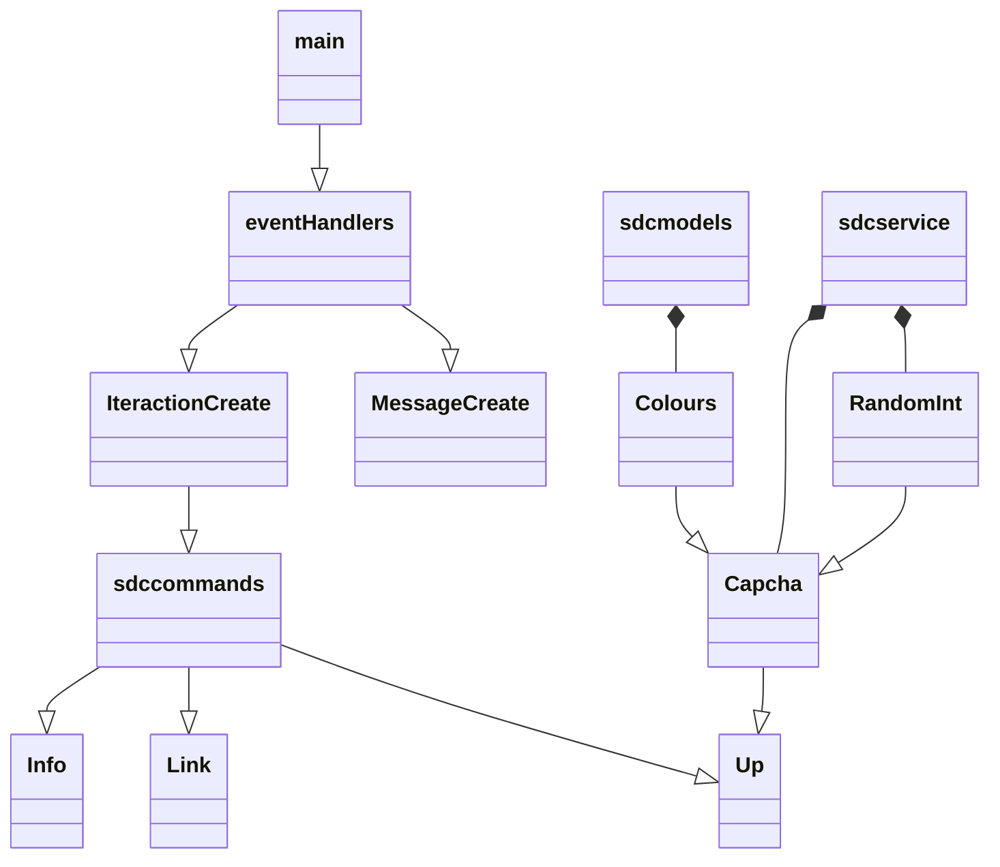

```mermaid
classDiagram

main --|> eventHandlers

sdccommands --|> Info
sdccommands --|> Link

sdccommands --|> Up
Capcha --|> Up

Colours --|> Capcha

eventHandlers --|> MessageCreate
eventHandlers --|> IteractionCreate

IteractionCreate --|> sdccommands

sdcmodels *-- Colours

sdcservice *-- Capcha
sdcservice *-- RandomInt

RandomInt --|> Capcha
```
